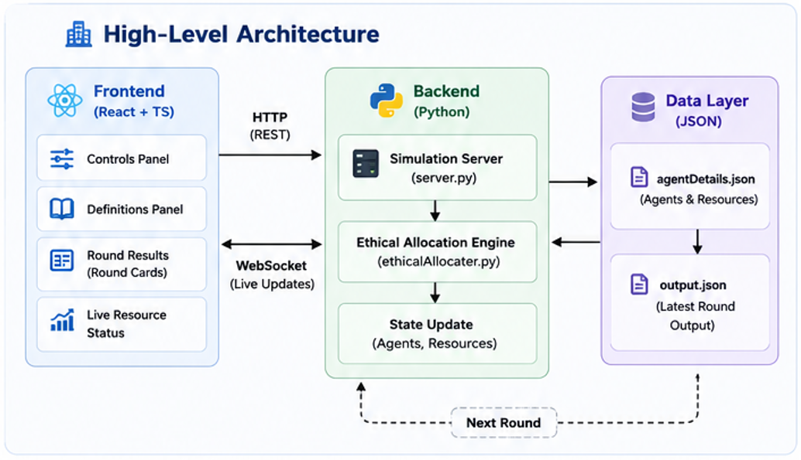
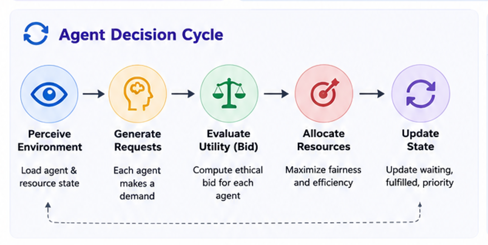
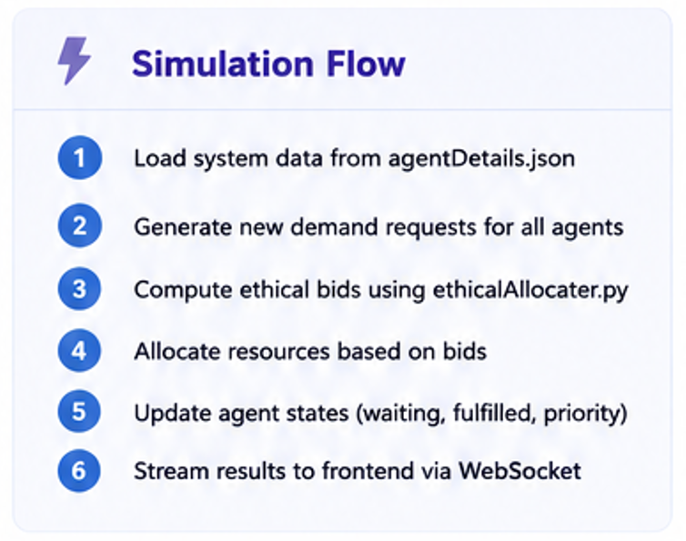
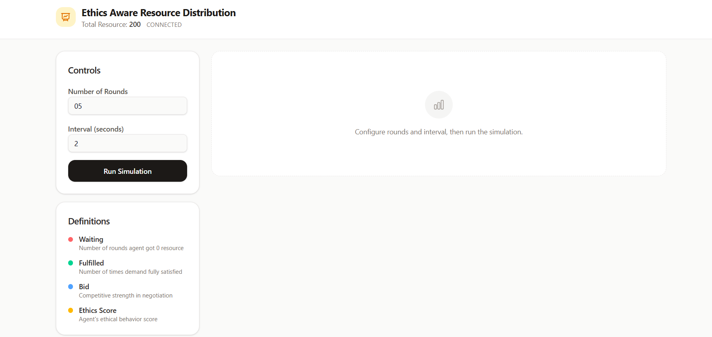
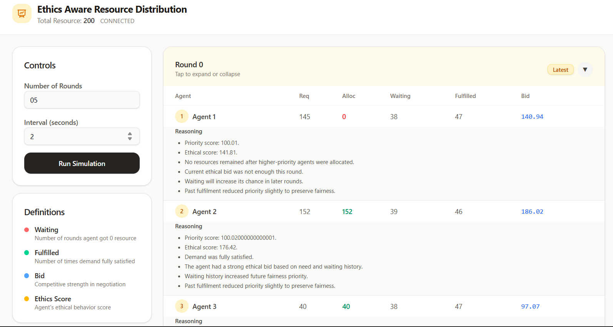
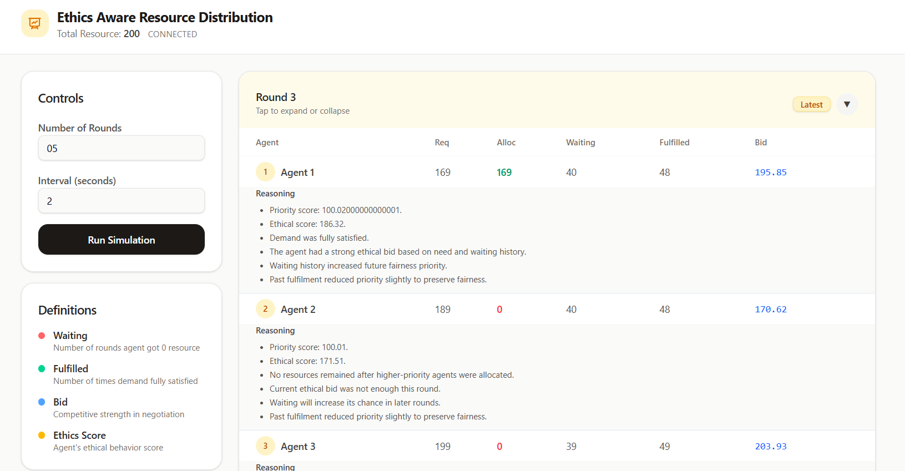

# ⚖️ Ethical Resource Flow

### A Utility-Based Intelligent Agent for Ethical Resource Allocation


*A real-time simulation platform demonstrating how a **Utility-Based Intelligent Agent** allocates limited resources ethically while balancing fairness, efficiency, and priority.*


---

# Overview

Ethical Resource Flow simulates resource allocation among multiple competing agents. Instead of following predefined rules, the system employs a **Utility-Based Intelligent Agent** that evaluates every possible allocation and selects the one that maximizes an ethical utility score.

The project provides an interactive dashboard where each simulation round is streamed live using **HTTP** and **WebSocket**, allowing users to visualize every decision made by the intelligent agent.

---

# Features

- Utility-Based Intelligent Agent
- Ethical resource allocation using utility scoring
- Fairness and efficiency aware decision making
- Real-time simulation updates via WebSocket
- Interactive React dashboard
- Configurable simulation rounds and interval
- Live visualization of agent state and allocation reasoning
- Modular architecture with separate frontend and backend

---

# Why Utility-Based Agent?

Unlike rule-based systems, ethical resource allocation requires balancing multiple competing objectives.

The intelligent agent evaluates:

- Fairness
- Resource availability
- Agent priority
- Waiting time
- Allocation efficiency

Rather than following hardcoded rules, the agent computes a utility score for each possible allocation and selects the action that maximizes the overall system utility.

---
# High-Level Architecture

<p align="center">
  
</p>

---

# Agent Decision Cycle


<p align="center">
  
</p>


---
# Simulation Workflow


<p align="center">
  
</p>

---


# How It Works

1. Load agent and resource information from **agentDetails.json**.
2. Generate a new demand request for every agent.
3. Compute ethical bids using **ethicalAllocater.py**.
4. Allocate resources based on utility while balancing fairness and efficiency.
5. Update each agent's state including waiting, fulfilled, and priority values.
6. Stream simulation updates through **server.py** using HTTP and WebSocket.
7. Display round-by-round visualization in the React dashboard.


---
# Screenshots

## Run configuration
<p align="center">
  
</p>

---

## Round Outputs


<p align="center">
  
</p>

<p align="center">
  
</p>

---


# Project Structure

```
ethical-resource-flow/
│
├── src/                     # React Frontend
│   ├── components/
│   ├── routes/
│   ├── ui/
│   └── index.tsx
│
├── ethicalAllocater.py      # Utility-based allocation engine
├── server.py                # HTTP & WebSocket server
├── simulator.py             # Simulation runner
├── run.py                   # Application launcher
│
├── agentDetails.json        # Agent & resource data
├── output.json              # Latest simulation output
│
├── package.json
├── requirements.txt
└── README.md
```

---

# Tech Stack

### Frontend

- React
- TypeScript
- Vite
- Tailwind CSS
- WebSocket

### Backend

- Python
- FastAPI
- HTTP APIs
- WebSocket

### Data

- JSON

---

# Running the Project

### Backend

```bash
pip install -r requirements.txt
python run.py
```

### Frontend

```bash
npm install
npm run dev
```

---

# Future Improvements

- Reinforcement Learning based allocation
- Dynamic utility function tuning
- Multi-objective optimization
- Agent analytics dashboard
- Database integration
- Multi-user simulation support

---

# Author

<div >

## Saurabh Tripathi , Harsh Kandra

**M.Tech CSE, NIT Calicut**

Full-Stack Developer • Intelligent Systems • Backend Development

</div>